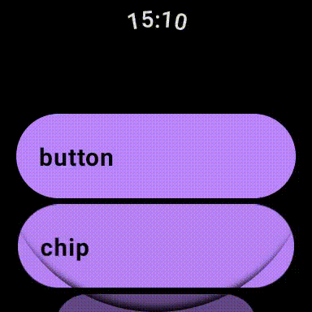

# Compose for Wear OS サンプル
Compose for Wear OSのサンプル実装アプリです。スタンドアロンで動くのでスマホや通信環境は必要ありません（デバッグのためには必要です）。

# 機能リスト

- button
- card
- chip
- dialog
- horologist
- list
- navigation
- pager
- picker

# 参考資料
このリポジトリはこちらの書籍の内容とリンクしています。参考の手助けにしてください。

https://techbookfest.org/product/cGiwAgnfVFhYKWt11HPHhr?productVariantID=nCfunqzCManD0fg3ytS1cN

